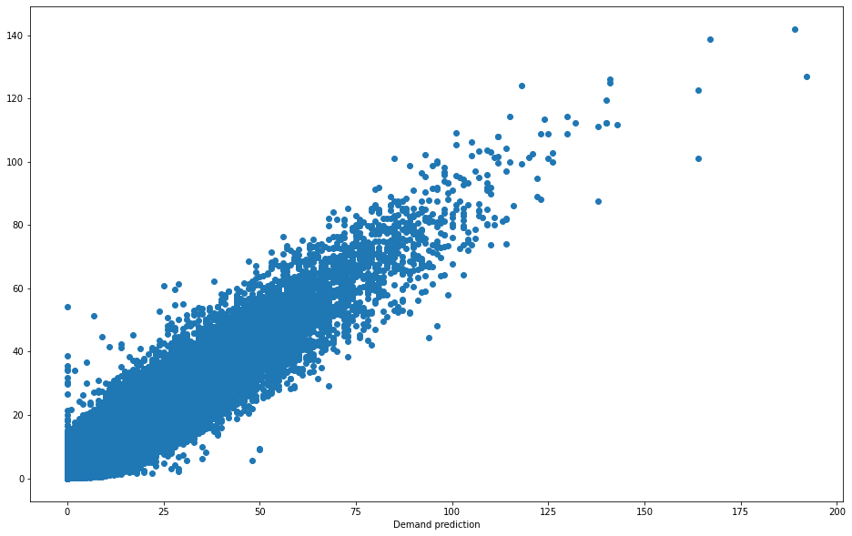
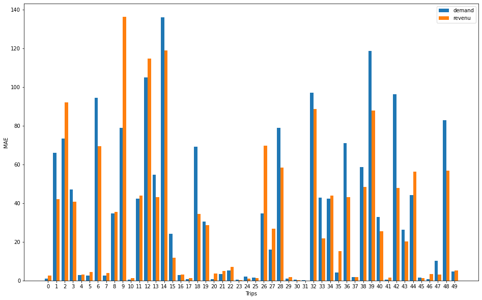

# Wiremind Data-Scientist Test

## Requirement
see the requirements.txt

## Local utilisation
You can create virtualenv
```
virtualenv -p python3 venv
```

Activate the virtualenv
```
source venv/bin/activate
```

Install requirements
```
pip install -r requirements.txt
```

launch from terminal
```
python ./pipeline/main.py
```


## In Docker
Build docker image
```
docker build -t datascientist .
```

Launch in docker
```
docker run -it datascientist
```
### Data analysis

The data analysis performed is in the "data_analysis" notebook. I did not find any outliers, the data was already processed initially.

Among other things, I deleted all the values at -1 for the "od_number_of_similar_X_hours".

Also two columns were identical, if I remember correctly it was the sale_month and sale_week columns I made the correction.


### Model training

I have trained two XGBoost. The first targets demand, the second targets revenue.

The first is the most intuitive, the choice of the second is explained as follows:

The objective being to maximize the income, by optimizing on the income the model considers the price as an adjustment weight. Thus the model is naturally more precise when is raised and vice versa.

I decided to deploy only one of the two models on the docker, for lack of time. But also because the performance of the two models is on average almost equivalent (slight advantage for the model trained on income)

### Model validation


For the validation of the model I followed the instructions.

The code offers a random draw of 20 train id as an evaluation sample as an evaluation sample.

The choice of 20 is an arbitrary choice it is easy to change it in the code, it is a global variable in the evaluation script.

### Performance XGBOOST for demand target.



### Performance XGBOOST for revenu target.


### Performance comparaison



### Improvement clue


Several improvements are possible, the first is the study of use of other model than the XGBoost. I chose the latter because it is generally the best model for forecasting on structured data.

I used Bayesian optimization for the hyperparameterization of the model, however not having the necessary computing power I had to limit the search for the optimal parameter. We can therefore hope that more in-depth research would provide better performance.

In addition, the increase in data, I think that by coupling data to that present in the dataset we can obtain better performance, especially meteorological data. It is not absurd to think that there is a correlation between going on vacation and the weather.

